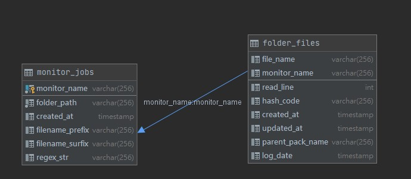

# DB_SCHEMA

 

---

 

由於需要儲存目標目錄檔案結構，與讀取狀態，所以需要使用持久化技術，這裡我選擇使用 sql database。

 
 

一共只需要 2 張 table：

 

* folder_file

* monitor_jobs

 

 

### `monitor_jobs`

 

`monitor_name` 是 PK，每一個監控任務都有一個自己獨有的任務名稱。

`floder_path` 是監控的資料夾絕對路徑。

`create_at` 任務建立時間。

`filename_prefix` 被監管的檔案名前綴。

`filename_surfix` 被監管的檔案名後綴。

`regex_str` 檔名正則表達式。

 
 

### `folder_file`

 

`file_name` 單個檔案的名稱。

`monitor_name` FK，用來關聯 monitor_jobs 表。

`read_line` 已被讀取得行數。

`hash_code` 檔案內容的 hash code，檢視檔案的 hash code 與 db 中的是否一致，可以判斷是否內容異動過。

`created_at` 檔案建立日期。

`updated_at` 檔案更新日期。

`parent_pack_name` 如果這個檔案上層有目錄，就會記錄在這裡。如果沒有就是空字串 

`log_date` 被記錄到 db 的日期。

 

